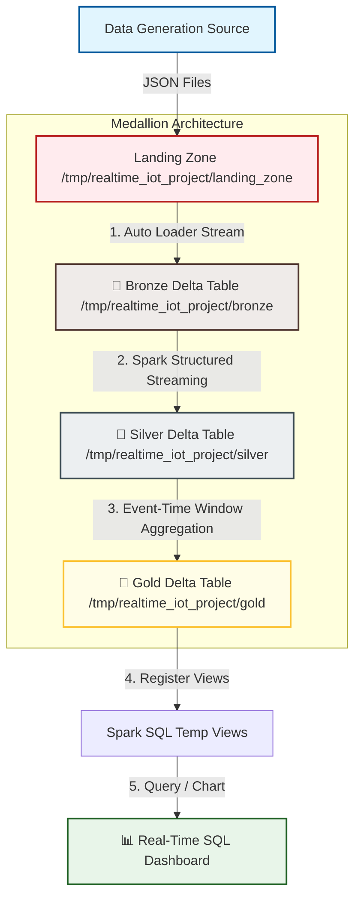

# 🚀 Real-Time IoT Telemetry Streaming Pipeline in Databricks

Welcome to the **Real-Time IoT Telemetry Streaming Pipeline**! This project is designed as a complete, production-ready blueprint that is simple enough for a beginner to master, yet robust enough to show off to clients, team leads, or project managers. 

This document serves as your complete guide. It includes the **Implementation Plan**, a **File-by-File Technical Deep Dive**, the **Business Use Cases**, and **Step-by-Step Presentation Scripts** you can use to explain this project to others.

---

## 📋 Table of Contents
1. [🎯 Project Purpose & Business Use Cases](#-project-purpose--business-use-cases)
2. [🏗️ The Implementation Plan (Blueprint)](#%EF%B8%8F-the-implementation-plan-blueprint)
3. [📂 File-by-File Breakdown (What, Why, and how to Pitch it)](#-file-by-file-breakdown-what-why-and-how-to-pitch-it)
4. [🛠️ Step-by-Step Installation & Setup](#%EF%B8%8F-step-by-step-installation--setup)
5. [🔄 Operational Runbook: Running & Resetting the Pipeline](#-operational-runbook-running--resetting-the-pipeline)
6. [🗣️ How to Present this Project to a Client/PM](#%EF%B8%8F-how-to-present-this-project-to-a-clientpm)
7. [🖥️ Interactive Medallion Web Visualizer (Offline Demo)](#%EF%B8%8F-interactive-medallion-web-visualizer-offline-demo)

-—
## 🎯 Project Purpose & Business Use Cases

### What does this project do?
This project simulates real-time data flow from smart IoT sensors (like temperature, humidity, and vibration sensors) and runs it through a stream-processing pipeline using the **Medallion Architecture** in Databricks.

### Where is this used in the real world?
1. **🏭 Factory Machinery (Industrial IoT):** Monitoring conveyor belts or wind turbine temperatures. If a sensor gets too hot, the system flags a `CRITICAL` alert instantly to prevent factory fires or engine meltdowns.
2. **🚚 Logistics & Fleet Management:** Tracking refrigerated trucks carrying medicine or fresh food. If the temperature goes above a threshold, alerts are sent to the driver to prevent food spoilage.
3. **🏠 Smart Home Diagnostics:** Tracking smart thermostats or humidity sensors in server rooms to detect HVAC system failures.

---

## 🏗️ The Implementation Plan (Blueprint)

This pipeline uses the **Medallion Architecture** (Bronze ➡️ Silver ➡️ Gold), which is the industry-standard design pattern for building reliable Data Lakes (also called **Lakehouses**).



### Why Medallion?
Rather than doing all cleaning and calculations in one giant, messy step, we break the work into three clean stages. This makes debugging simple, allows us to recover from errors easily, and ensures our final reporting data is 100% correct.

---

## 📂 File-by-File Breakdown (What, Why, and How to Pitch it)

Here is a breakdown of every single file in the project. Use this when explaining the code structure to your colleagues or manager.

---

### 1. ⚙️ [00_Setup_Config.py](file:///c:/Users/Vsdee/OneDrive/Desktop/kapeed/Databricks%20project/notebooks/00_Setup_Config.py)
* **What it is:** The configuration foundation. It defines where files are saved in DBFS, creates folders, defines the strict database structure (schema), and includes a reset function to wipe files. It also has a built-in data generator for cloud testing.
* **Why we used it:** 
  * **Directory Configuration:** Centralizing path variables prevents bugs caused by copy-pasting strings across different notebooks.
  * **Strict Schema Enforcing:** Forces incoming data to conform to set types (e.g., `temperature` must be a decimal, `device_id` must be text) so bad data doesn't crash the pipeline.
  * **Internal Simulator:** Allows users to run the entire pipeline inside Databricks without setting up a local computer.
* **School Kid Analogy:** Preparing your workspace. Before you start drawing, you make sure you have your pencil cases organized and know exactly where every color goes.
* **Client/PM Pitch:** *"This config notebook ensures consistency and reproducibility. It allows us to manage environments (Dev, Staging, Prod) easily by simply changing the base directory path, and contains an automated cleanup script to facilitate CI/CD unit testing."*

---

### 2. 🥉 [01_Bronze_Ingestion.py](file:///c:/Users/Vsdee/OneDrive/Desktop/kapeed/Databricks%20project/notebooks/01_Bronze_Ingestion.py)
* **What it is:** Ingests raw streaming JSON files from the landing directory and saves them directly to a raw Delta table called the Bronze Layer.
* **Why we used it:**
  * **Databricks Auto Loader (`cloudFiles`):** Standard cloud file listing is slow and expensive. Auto Loader scales to millions of files efficiently by incrementally tracking new arrivals without listing the entire directory.
  * **Audit Metadata:** We append `_input_file_name` and `_ingested_time`. If a record looks suspicious later, we can trace it back to the exact JSON file and timestamp it arrived.
* **School Kid Analogy:** The big toy chest. As soon as toys arrive, a robot assistant grabs them and throws them in the chest. It doesn't sort them yet; it just makes sure they are safely in the house.
* **Client/PM Pitch:** *"Bronze Ingestion is optimized for high-speed write efficiency. By decoupling raw ingestion from complex business logic, we guarantee zero data loss. Auto Loader tracks state incrementally, minimizing file API call costs on cloud storage like S3 or Azure Blob Storage by up to 90%."*

---

### 3. 🥈 [02_Silver_Transformation.py](file:///c:/Users/Vsdee/OneDrive/Desktop/kapeed/Databricks%20project/notebooks/02_Silver_Transformation.py)
* **What it is:** Reads live data from the Bronze Delta table, cleanses it, filters out missing/corrupted values, parses string timestamps into official Spark timestamp datatypes, and saves the cleaned results to the Silver Layer.
* **Why we used it:**
  * **Data Cleansing:** Removes bad records (such as records with null humidity values generated by sensor glitches) so they don't corrupt our final reports.
  * **Casting & Formatting:** Standardizes data (e.g., rounding temperatures) to make it ready for analysis.
* **School Kid Analogy:** The toy washing station. We take toys from the messy Bronze box, wash off the dirt, throw away broken ones, and dry them.
* **Client/PM Pitch:** *"The Silver Layer represents the clean, validated 'Single Source of Truth'. Thanks to Delta Lake's ACID compliance, we ensure that even during concurrent streaming, the table is never left in a corrupt state. All downstream BI models and analysts query this table, preventing conflicting reports."*

---

### 4. 🥇 [03_Gold_Aggregations.py](file:///c:/Users/Vsdee/OneDrive/Desktop/kapeed/Databricks%20project/notebooks/03_Gold_Aggregations.py)
* **What it is:** Reads from the Silver Delta table, groups data into time-based windows, calculates rolling averages, and flags temperature safety alerts (anomalies > 80°C), saving them into the Gold Layer.
* **Why we used it:**
  * **Event-Time Windowing:** Groups data based on when the sensor *recorded* it, not when Spark *received* it.
  * **Watermarking:** Spark discards event state after a specified time window (e.g., 10 minutes) so memory doesn't fill up indefinitely.
* **School Kid Analogy:** The display shelf. We group toys by type and color in little bundles (5-minute blocks). If we find a toy that is too hot, we stick a red warning label on it.
* **Client/PM Pitch:** *"Gold contains high-value aggregated data. Pre-calculating windowed averages as the stream runs avoids running heavy SQL GROUP BY operations on raw logs. Dashboards load in milliseconds rather than minutes, saving compute cluster costs."*

---

### 5. 📊 [04_Dashboard_Queries.py](file:///c:/Users/Vsdee/OneDrive/Desktop/kapeed/Databricks%20project/notebooks/04_Dashboard_Queries.py)
* **What it is:** Registers the Delta tables as temporary SQL views, enabling analysts to write standard SQL queries, set up alerts, and build visual dashboards.
* **Why we used it:**
  * **SQL Compatibility:** Allows team members who do not write Python or Spark to query real-time data using familiar standard SQL queries.
* **School Kid Analogy:** Letting your friends look at your shelf of toys and count how many red ones they see, without touching the boxes.
* **Client/PM Pitch:** *"This notebook bridges the gap between raw data engineering and business reporting. These SQL views can connect directly to Databricks SQL Dashboards, PowerBI, or Tableau, feeding live operational dashboards with sub-second performance."*

---

### 6. 🤖 [data_generator.py](file:///c:/Users/Vsdee/OneDrive/Desktop/kapeed/Databricks%20project/data_generator.py)
* **What it is:** A local Python script that simulates real IoT devices. It runs locally on your computer and writes JSON telemetry data to your hard drive every 5 seconds.
* **Why we used it:**
  * **Realism:** Replicates real hardware devices pushing data files to cloud storage folders.
  * **Pipeline Testing:** It is programmed to occasionally inject "warnings" (high temperatures) and "corrupted columns" (null values) to test if our Silver cleaning and Gold alerts actually work.

---

## 🛠️ Step-by-Step Installation & Setup

### Step 1: Create a Databricks Workspace
Sign up for a corporate Databricks workspace or create a free sandbox account on [Databricks Community Edition](https://community.cloud.databricks.com/).

### Step 2: Spin Up a Starter Cluster
1. Navigate to **Compute** on the left menu sidebar.
2. Click **Create Compute** (or Create Cluster).
3. Name it (e.g., `Streaming-Demo-Cluster`).
4. Select the default Databricks Runtime (Runtime 11.3 LTS or higher).
5. Click **Create Cluster** and wait for the status circle to turn green (3–5 minutes).

### Step 3: Import Project Notebooks
1. Go to **Workspace** -> **Users** -> **[Your Email]**.
2. Click the three dots `...` next to your email folder, and select **Import**.
3. Import the files in the `notebooks/` directory:
   * [00_Setup_Config.py](file:///c:/Users/Vsdee/OneDrive/Desktop/kapeed/Databricks%20project/notebooks/00_Setup_Config.py)
   * [01_Bronze_Ingestion.py](file:///c:/Users/Vsdee/OneDrive/Desktop/kapeed/Databricks%20project/notebooks/01_Bronze_Ingestion.py)
   * [02_Silver_Transformation.py](file:///c:/Users/Vsdee/OneDrive/Desktop/kapeed/Databricks%20project/notebooks/02_Silver_Transformation.py)
   * [03_Gold_Aggregations.py](file:///c:/Users/Vsdee/OneDrive/Desktop/kapeed/Databricks%20project/notebooks/03_Gold_Aggregations.py)
   * [04_Dashboard_Queries.py](file:///c:/Users/Vsdee/OneDrive/Desktop/kapeed/Databricks%20project/notebooks/04_Dashboard_Queries.py)

---

## 🔄 Operational Runbook: Running & Resetting the Pipeline

### How to Run the Pipeline (First Time or Every Time)

#### 1. Configure the Paths
Open **`00_Setup_Config`** and run the first cell to load all folder paths into memory.

#### 2. Start the Simulated Data Feed
* Scroll to the last cell of **`00_Setup_Config`**.
* Run the cell containing `generate_dbfs_mock_data()`.
* This starts writing simulated JSON files to the DBFS landing zone. You will see statements like: `Created file: /tmp/realtime_iot_project/landing_zone/...` printing out.

#### 3. Run the Streams in Order
1. Go to **`01_Bronze_Ingestion`** and click **Run All**. Check that the stream status box displays green **"Stream active"** text. Run the bottom verification cell to see data.
2. Go to **`02_Silver_Transformation`** and click **Run All**. Verify the stream starts and displays cleaned fields.
3. Go to **`03_Gold_Aggregations`** and click **Run All**. Verify that rolling aggregates are processing.
4. Go to **`04_Dashboard_Queries`** and run cells to view your real-time analytics SQL charts!

---

### How to Reset the Environment (To Start Fresh)
If you want to clear out old data and run a clean demo:
1. Open **`00_Setup_Config`**.
2. Find the cleanup cell:
   ```python
   # If you want to reset, uncomment the line below and run:
   # reset_pipeline()
   ```
3. Remove the `#` comment symbol from the line `# reset_pipeline()`.
4. Run that cell. It will delete all files under `/tmp/realtime_iot_project/`.
5. Put the `#` back to comment out the line (protects against accidental resets during live runs): `# reset_pipeline()`.

---

### How to Stop the Streams (When Done)
Streaming runs active clusters. To avoid wasting cloud resources:
* Open each active streaming notebook (`01`, `02`, `03`).
* Click **Stop All** at the top right of the notebook, or click **"Cancel"** directly on the active stream execution cell.

---

## 🗣️ How to Present this Project to a Client/PM

Use these scripts during a presentation or demo to make your work sound professional:

### 1. The Opening Pitch (Explaining the Goal)
> *"Hello! Today, I want to show you a real-time data pipeline for IoT device logs using the Medallion Architecture on Databricks. We are simulating a fleet of smart sensors. Our goal is to ingest raw sensor readings, clean out corrupted data, compute rolling 5-minute averages, and trigger real-time alerts if any device overheats. This setup is highly applicable in industries like smart factory automation, fleet tracking, and logistics."*

### 2. Presenting the Bronze Layer (Ingestion)
> *"For our Bronze layer, we used Databricks Auto Loader. Instead of scheduling an expensive folder scan every few minutes, Auto Loader incrementally detects and ingests files the second they hit cloud storage. This minimizes read/write operations, saving up to 90% in cloud storage costs compared to traditional file checking. We also append ingestion timestamps for data lineage."*

### 3. Presenting the Silver Layer (Quality Control)
> *"In the Silver layer, we transform the raw JSON records into a clean schema. We filter out rows that contain null values due to device glitches. Because we write this to a Delta table, we benefit from ACID transactions. This means that if a write is interrupted, Delta Lake automatically rolls it back, ensuring our database is never left in a corrupted state."*

### 4. Presenting the Gold Layer & Dashboard (Value Delivery)
> *"Finally, in the Gold layer, we use PySpark Event-Time Windowing and Watermarking to handle late-arriving data. We calculate 5-minute rolling averages and trigger a 'CRITICAL' flag if temperatures exceed 80°C. By pre-aggregating the data here, we ensure that our BI dashboards load instantly in under a second, without making our SQL engines run heavy GROUP BY queries on raw logs."*

---

## 🖥️ Interactive Medallion Web Visualizer (Offline Demo)

To help you demonstrate the pipeline's real-time mechanics to a Project Manager, client, or in a presentation, we have built an **Interactive Web Visualizer** directly inside this workspace.

### What is it?
It is a single-page web dashboard (`dashboard/index.html`) that simulates the entire Spark Streaming pipeline visually. It lets you watch data travel in real-time through the Landing Zone, Bronze Table, Silver Table, and Gold Table, while presenting live analytics charts and explanation cards.

### Why we used it:
* **Zero Cost/Setup Presentation:** A real Databricks cluster requires cloud credits and takes 5 minutes to spin up. This web visualizer launches database tables instantly on any machine offline.
* **Controlled Demonstrations:** You can trigger simulated data errors and sensor overheat warnings on demand using custom UI buttons to demonstrate the pipeline's resilience.

### How to Run it:
1. Open your terminal or command prompt in the project root folder.
2. Run the launcher script:
   ```bash
   python run_dashboard.py
   ```
3. A local server will start and open your web browser automatically to: `http://localhost:8524`
4. Click **"Start Ingestion"** to watch the streaming simulation begin.
5. Use the **"Inject Anomaly"** and **"Inject Corrupt"** buttons to see how the Bronze, Silver, and Gold layers process data glitches in real-time.
